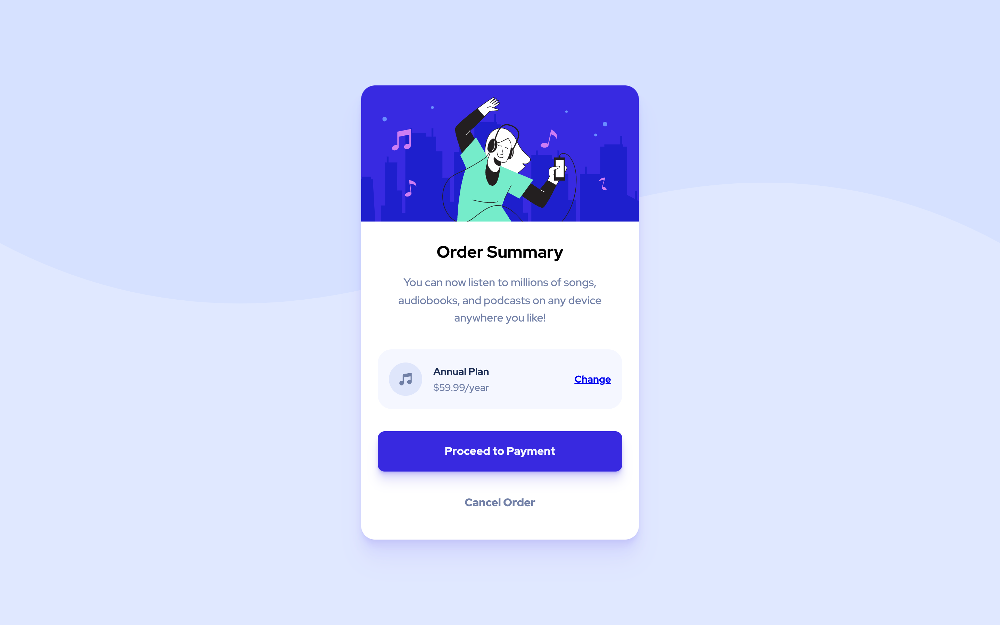

# Frontend Mentor - Order summary card solution

This is Max Ruuen's solution to the [Order summary card challenge on Frontend Mentor](https://www.frontendmentor.io/challenges/order-summary-component-QlPmajDUj). Frontend Mentor challenges help you improve your coding skills by building realistic projects.

## Table of contents

- [Overview](#overview)
  - [The challenge](#the-challenge)
  - [Screenshot](#screenshot)
    - [Desktop Layout](#desktop-layout)
    - [Mobile Layout](#mobile-layout)
  - [Links](#links)
- [My process](#my-process)
  - [Built with](#built-with)
  - [What I learned](#what-i-learned)
- [Author](#author)

## Overview

### The challenge

Users should be able to:

- See hover states for interactive elements

### Screenshot

#### Desktop Layout

#### Mobile Layout

### Links

- Solution URL: [Frontendmentor.io](https://www.frontendmentor.io/solutions/order-summary-card-component-using-sass-7XvKSACSH)
- Live Site URL: [Netlify](https://rd-challenge-order-summary.netlify.app/)

## My process

### Built with

- HTML5
- SASS
- CSS Flex
- SVG

### What I learned

This was a fun challenge to attempt, and I ended up exploring a lot of functions within SASS while finding the `lighten()` function. I didn't end up using any other SASS functions, but they seem super useful!

I think I'm not using SASS's nesting the way it was intended - I love the idea of nesting CSS & understand the pitfalls of over-nesting and the specificity it may unintentionally apply which makes troubleshooting/reusability harder, but I feel like I'm not nesting how I should out of the "over-nesting" fear.

I feel that I was able to demonstrate more control over the spacing and sizings of a responsive component - I would like to try integrating this component into a full site just to learn more about how it would behave in a real layout.

BEM is still taking some thought to practice as I try not to overcomplicate class names, but it is definitely proving useful in easily navigating styles.

On an unrelated note, I learned how to change the message of an existing commit and re-push this through to my GitHub repo, picking up some useful but frustrating knowledge of the Vi terminal text editor along the way.

## Author

- Frontend Mentor - [@ruuendigital](https://www.frontendmentor.io/profile/ruuendigital)
- Twitter - [@maxruuen](https://www.twitter.com/maxruuen)
